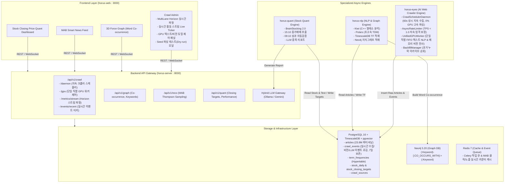

# Horus 2.0 시스템 조감도 (System Overview)

## 1. 시스템 개요 및 비전

**Horus 2.0**은 대규모 웹 뉴스 및 커뮤니티 데이터(2,380만 건 이상)를 실시간 수집, 자연어 처리(NLP), 지식 그래프(Knowledge Graph) 구축, 퀀트 주식 분석(Stock Quant), 그리고 인공지능 추천 시스템을 유기적으로 연결하는 **AI 기반 시계열 텍스트·금융 인텔리전스 플랫폼**입니다.

과거 무거운 JVM/Spark 기반의 레거시 구조에서 탈피하여, **경량 고성능 Python 3.11+, TimescaleDB, pgvector, Neo4j, Redis, FastAPI, Next.js 14+** 기반의 현대적 마이크로서비스 아키텍처로 전면 재설계되었습니다.

---

## 2. 전체 시스템 아키텍처 다이어그램



---

## 3. 서브시스템별 책임과 역할 (Components Breakdown)

| 모듈명 | 기술 스택 | 주요 역할 및 책임 | 주요 문서 |
| :--- | :--- | :--- | :--- |
| **`horus-eyes`** | Python 3.11, httpx, Trafilatura, Playwright, Ollama/VLM | 상시 지속 크롤링 데몬(60s 주기), 저속 방화벽 우회(TPS < 1.0), Unified GPU 직렬 큐(텍스트 요약/감성 + 인메모리 Base64 비전 전사) | [`SPEC-001`](file:///Users/horus/dev/horus-dev/docs/specs/SPEC-001-horus-eyes-crawler.md) |
| **`horus-nlp`** | Python 3.11, Kiwi (C++), Polars, PyNeoInstance | 초고속 형태소 분석, 시계열 단어 빈도(TF) 집계, 지식 그래프 동시출현 엣지 생성 | [`SPEC-002`](file:///Users/horus/dev/horus-dev/docs/specs/SPEC-002-horus-nlp-graph.md) |
| **`horus-quant`** | Python 3.11, Pandas, AsyncPG, Gemini SDK | 15:10 당일 종가매매 타겟 발굴, 09:10 익일 시가/고가 수익률 자동 검증 | [`SPEC-003`](file:///Users/horus/dev/horus-dev/docs/specs/SPEC-003-horus-quant-stocking.md) |
| **`horus-server`** | FastAPI, SQLAlchemy 2.0 Async, Redis, Ollama | REST API 서비스, 다중 레인 Horizon 스트림 파형 제공, GPU/데몬 제어 API, MAB 뉴스 추천 | [`SPEC-004`](file:///Users/horus/dev/horus-dev/docs/specs/SPEC-004-horus-server-api.md) |
| **`horus-web`** | Next.js 14 (App Router), TypeScript, TailwindCSS, 3d-force-graph | 관리자 대시보드(Horizon 스트림 차트, Live Activity Ticker, GPU 듀얼 제어), 3D 지식그래프 뷰어, 퀀트 분석 UI | [`SPEC-005`](file:///Users/horus/dev/horus-dev/docs/specs/SPEC-005-horus-web-frontend.md) |

---

## 4. 데이터 파이프라인 라이프사이클 (End-to-End Data Flow)

1. **상시 지속 수집 단계 (`horus-eyes` - `CrawlSchedulerDaemon`)**:
   - 60초 주기(설정 가능)로 모든 활성 `crawl_sources`를 순회하여 신규 기사 링크 탐색.
   - DB에 이미 존재하는 기사는 건너뛰고(`_filter_new_urls`), 신규 기사만 초당 1.0 TPS 이하(1.5s 딜레이)로 고속 CPU 파싱 적재.
   - 수집된 모든 이벤트(`seed_scan`, `article_ingest`, `image_ingest`)는 `crawl_events`에 실시간 로깅.
2. **단일 직렬 GPU AI 정제 단계 (`horus-eyes` - `UnifiedGPUWorker`)**:
   - VRAM 충돌 방지를 위해 단일 루프에서 FIFO 순차 실행.
   - **비전 Image-to-Text**: 메모리 Base64 처리로 디스크 부담 없이 VLM 추론 $\rightarrow$ 본문에 설명 주입 $\rightarrow$ 원본 URL 보존.
   - **텍스트 NLP**: 3줄 요약, 감성 분석 점수(-1.0 ~ 1.0), 주요 엔티티 및 관련 종목 추출.
3. **자연어 처리 및 지식 그래프 단계 (`horus-nlp`)**:
   - 신규 수집된 기사의 본문을 Kiwi C++ 형태소 분석기로 명사/고유명사 토큰화.
   - 시계열 단어 빈도를 TimescaleDB Hypertable에 적재하고 Neo4j 동시출현 지식그래프 갱신.
4. **퀀트 주식 전략 단계 (`horus-quant`)**:
   - 15:10 수급 + 텍스트 모멘텀 결합 종가매매 타겟 발굴 및 Gemini 분석 리포트 저장.
   - 익일 09:10 수익률 및 전략 성공 여부 자동 검증.
5. **실시간 모니터링 & 서빙 단계 (`horus-server` & `horus-web`)**:
   - 프론트엔드가 다중 레인 Horizon 스트림 파형 및 실시간 활동 스트림(3초 자동 갱신)으로 관제.
   - MAB 기반 스마트 뉴스 피드 서빙.

---

## 5. 프로젝트 디렉토리 레이아웃

```text
/Users/horus/dev/horus-dev/
├── docs/                           # [LLM Wiki] 단일 진실 공급원(SSOT) 문서 시스템
│   ├── SYSTEM_OVERVIEW.md          # 본 문서
│   ├── STATE.md                    # 구현 상태 및 Next Tasks
│   ├── adr/                        # 아키텍처 결정 기록 (ADR-001 ~ ADR-005)
│   └── specs/                      # 서브시스템별 정밀 스펙 (SPEC-001 ~ SPEC-005)
├── docker/                         # 인프라 정의 (Docker Compose, DB 초기화 DDL)
├── horus-eyes/                     # AI 크롤러 (CrawlSchedulerDaemon, UnifiedGPUWorker)
├── horus-nlp/                      # 형태소 분석 및 Neo4j 지식그래프 파이프라인
├── horus-quant/                    # 종가매매 퀀트 스캐너 및 성과 검증 엔진
├── horus-server/                   # FastAPI 백엔드 API 게이트웨이
├── horus-web/                      # Next.js 14 프론트엔드 대시보드
├── scripts/                        # 인프라 및 DB 초기화 헬퍼 스크립트
├── run_all.sh                      # 원클릭 전체 실행 스크립트 (Ctrl+C 일괄 안전 종료)
├── run_server.sh / run_web.sh      # 개별 서비스 실행 스크립트
├── PROJECT_CONTEXT.md              # 이전 세션 핸드오버 컨텍스트
└── README.md                       # 프로젝트 시작 가이드
```
