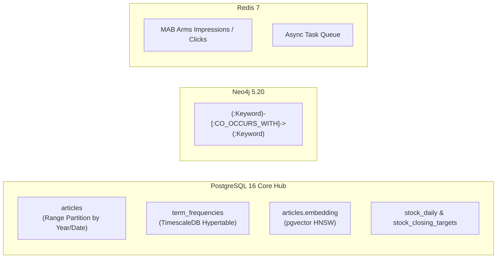

# ADR-003: 다중 저장소(Polyglot Persistence) 및 스토리지 아키텍처 전략

## 1. 배경 및 문제 상황 (Context & Problem Statement)

Horus 2.0은 네 가지의 완전히 다른 데이터 접근 패턴을 요구합니다:
1. **2,380만 건 이상의 대규모 텍스트 아카이브**: 날짜별 파티셔닝, 한국어 전문검색(Trigram/GIN), 시맨틱 임베딩 검색.
2. **초단위/분단위 시계열 집계**: 단어 빈도(Term Frequency)의 지속적 업데이트 및 롤업 쿼리.
3. **단어 동시출현 지식 그래프**: 키워드 간의 2차/3차 이웃 노드 탐색 및 경로 탐색.
4. **고속 실시간 캐시 및 작업 큐**: MAB 노출/클릭 수 실시간 카운터 및 비동기 워커 큐.

과거에는 MySQL, InfluxDB, Neo4j를 제각각 독립 서버로 운영하여 리소스 낭비와 분산 트랜잭션 불일치가 심각했습니다.

---

## 2. 결정 (Decision Outcome)

**PostgreSQL 16을 데이터의 핵심 허브(Hub)로 두고, 시계열(TimescaleDB)과 벡터(pgvector)를 인-엔진(In-Engine)으로 통합하며, 지식 그래프는 Neo4j, 실시간 큐/캐시는 Redis로 역할을 명확히 분리합니다.**

### 세부 계층별 역할 정의:
* **PostgreSQL + TimescaleDB**:
  * `articles`: 연도/월 단위 파티셔닝 적용. `title` 및 `content`에 `gin_trgm_ops` 인덱스 생성하여 2천만 건 대상 고속 유사도 검색 지원.
  * `term_frequencies`: TimescaleDB `create_hypertable`을 적용하여 단어 빈도 데이터의 시간 기반 고속 인덱싱 및 집계 보장.
  * `embedding`: `vector(768)` 컬럼을 두어 향후 LLM 시맨틱 검색 확장 준비.
* **Neo4j 5.20**:
  * 단어 간 동시출현 관계(`CO_OCCURS_WITH`)를 그래프 형태로 저장하여, 3D 시각화 및 키워드 연관도 탐색(`MATCH (k1:Keyword)-[r:CO_OCCURS_WITH]-(k2:Keyword)`)에만 집중 활용.
* **Redis 7.0**:
  * MAB(Multi-Armed Bandit) 알고리즘을 위한 기사별 실시간 노출/클릭 수 집계(Atomic INCR) 및 Celery 분산 큐.

---

## 3. 물리적 스토리지 볼륨 전략 (Physical Volume Strategy)

개발 머신(Apple Silicon Mac)의 내부 SSD 용량을 보호하고 I/O를 분산하기 위해, 모든 Docker 볼륨은 외장 고속 드라이브에 마운트합니다:
* 마운트 기본 경로: `/Volumes/VData/docker-runtime/horus/`
  * `/postgres` $\rightarrow$ PostgreSQL 16 데이터 디렉토리
  * `/neo4j/data` $\rightarrow$ Neo4j 지식그래프 데이터
  * `/redis` $\rightarrow$ Redis RDB/AOF 덤프

---

## 4. 기대 효과 및 결과 (Consequences)

* **운영 간소화**: 별도의 InfluxDB 클러스터를 제거하고 PostgreSQL 하나로 트랜잭션 RDBMS와 시계열 분석을 모두 충족.
* **조인(Join) 정합성**: 기사 원본과 주가 데이터, 크롤링 소스 간의 관계형 무결성 보장.
* **그래프 탐색 성능**: 복잡한 N-depth 연관어 쿼리는 Neo4j 인메모리 그래프 엔진을 활용하여 밀리초 단위 응답 보장.
