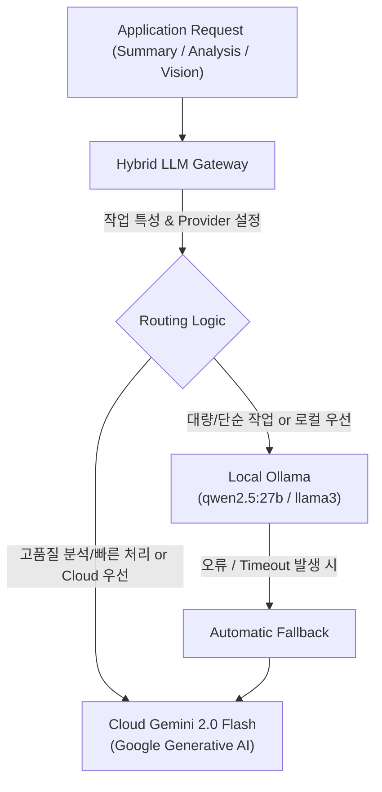

# ADR-004: 하이브리드 LLM 게이트웨이 (Local Ollama + Cloud Gemini) 아키텍처

## 1. 배경 및 문제 상황 (Context & Problem Statement)

Horus 2.0은 다양한 LLM 추론 작업을 요구합니다:
1. **대량 배치 작업**: 기사 이미지 설명 생성(Vision OCR/VQA), 크롤링된 기사 요약, 대량 키워드 추출.
2. **고성능 실시간 추론**: 15:10 종가매매 후보군에 대한 심층 퀀트 종목 분석 리포트 생성, 정밀 감성 분석.

모든 요청을 상용 클라우드 LLM(Gemini / OpenAI)으로 전송하면 **API 비용 폭증 및 Rate Limit 한계**에 직면하고, 반대로 로컬 LLM(Ollama)만 사용하면 **추론 품질과 GPU/메모리 부하 한계**가 발생합니다.

---

## 2. 결정 (Decision Outcome)

**`horus-server/app/llm/gateway.py`에 단일 인터페이스의 Hybrid LLM Gateway를 구현하고, 작업 특성에 따라 로컬 Ollama와 클라우드 Gemini 2.0 Flash로 지능형 라우팅 및 자동 Fallback을 수행하도록 결정했습니다.**



### 작업별 라우팅 전략:

| 작업 유형 | 기본 공급자 (Primary) | 예비 공급자 (Fallback) | 선정 사유 |
| :--- | :--- | :--- | :--- |
| **종목 분석 리포트 (`horus-quant`)** | **Gemini 2.0 Flash** | Ollama | 최신 금융 문맥 이해 및 복잡한 추론 품질 필요 |
| **기사 이미지 전사 (`horus-eyes`)** | **Ollama Vision / Gemini** | Gemini | 로컬 GPU 가용 시 비용 0원 처리, 대량 배치 시 클라우드 병렬화 |
| **기사 3줄 요약 & 엔티티 추출** | **Ollama (`qwen2.5:27b`)** | Gemini | 상시 대량 처리에 따른 API 비용 절감 |

---

## 3. 구현 표준 (Standard Interface)

모든 클라이언트 코드는 개별 SDK를 직접 호출하지 않고 `LLMGateway`를 통해서만 추론을 요청합니다.

```python
# 표준 호출 인터페이스
response = await llm_gateway.generate_text(
    prompt="...",
    system_prompt="...",
    provider="hybrid", # "ollama" | "gemini" | "hybrid"
    temperature=0.2,
    max_tokens=1000
)
```

---

## 4. 기대 효과 및 결과 (Consequences)

* **비용 절감**: 일상적인 대량 텍스트 처리는 로컬 Ollama로 흡수하여 클라우드 API 호출 비용 70% 이상 절감.
* **무중단 안정성(Resilience)**: 로컬 인퍼런스 서버가 죽거나 메모리 부족이 발생해도 자동으로 클라우드 Gemini로 Fallback되어 수집/분석 파이프라인 중단 방지.
* **에이전트 독립성**: 향후 모델이 변경되거나 신규 모델(Claude 등)이 추가되어도 게이트웨이 내부 어댑터만 수정하면 전체 파이프라인에 영향 없음.
