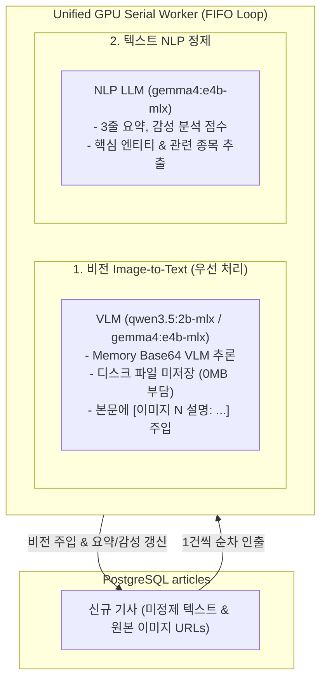

# ADR-005: 단일 직렬(Serial FIFO) GPU 큐 및 메모리 기반 비전 전사 아키텍처

## 1. 배경 및 문제 상황 (Context & Problem Statement)

크롤링 파이프라인에서 LLM 기반 후처리(텍스트 요약/감성 분석, 본문 이미지 OCR/VLM 설명 생성)를 동시에 실행할 때 다음과 같은 기술적 병목이 발생했습니다:

1. **로컬 GPU VRAM 충돌 및 Ollama 단일 스레드 병목**: 로컬 인퍼런스 환경(Apple Silicon MLX 또는 단일 GPU)에서 텍스트 LLM과 비전 VLM(예: Gemma, Qwen)이 병렬로 동시 호출되면 VRAM Out-of-Memory(OOM)가 발생하거나 Ollama 응답 지연(Timeout)이 발생함.
2. **이미지 파일 저장 시 로컬 디스크 용량 폭증**: 기사 수집 시 모든 이미지를 로컬 SSD 디스크 파일로 다운로드하여 저장하면 수십만 건 수집 시 수십~수백 GB의 불필요한 디스크 용량을 점유함.

---

## 2. 결정 (Decision Outcome)

**`horus-eyes/crawler/llm_worker.py`에 단일 직렬(Serial FIFO) GPU 작업 큐 워커(`UnifiedGPUWorker`)를 도입하고, 비전 처리는 로컬 디스크 파일 저장 없이 메모리(Base64) 상에서 즉시 처리하도록 결정했습니다.**

### 핵심 설계 규칙:
1. **단일 직렬 처리(Single Serial Loop)**: 비전과 텍스트 작업을 단일 루프에서 1건씩 순차 실행하여 GPU VRAM 점유율을 최소화하고 모델 충돌을 원천 차단.
2. **독립 서브시스템 제어**: 텍스트 NLP와 비전 Image-to-Text의 상태(IDLE/RUNNING/PAUSED/STOPPED) 및 사용할 모델을 각각 독립적으로 제어 가능.
3. **디스크 0MB 부담 (In-Memory Base64)**: 이미지는 네트워크 스트림에서 메모리로 직접 다운로드되어 VLM으로 전달되며, 전사 완료 후 본문에 설명만 주입되고 메모리에서 즉시 해제됨. 원본 절대 URL은 `metadata.images`에 영구 보존.

---

## 3. 기대 효과 및 결과 (Consequences)

* **안정적인 로컬 LLM 구동**: 단일 GPU/통합 메모리 환경에서도 VRAM 충돌이나 OOM 없이 장시간 안정적인 배치 처리 가능.
* **디스크 공간 극대화 절약**: 이미지 다운로드 파일로 인한 수십 GB의 스토리지 낭비 방지.
* **모니터링 및 제어성 향상**: 프론트엔드 대시보드에서 텍스트와 비전 워커를 개별적으로 켜고 끄며 대기 큐(Pending)를 실시간 모니터링 가능.
