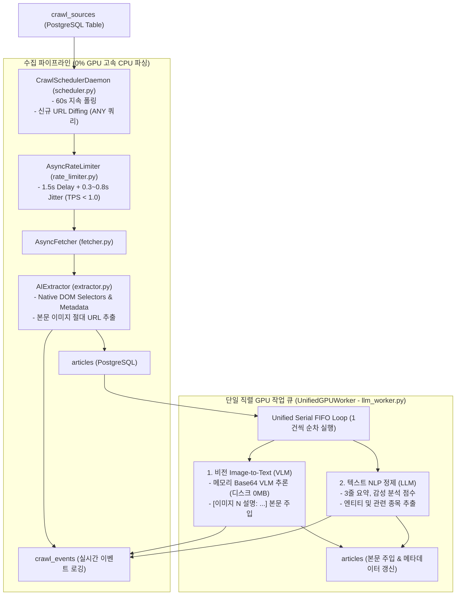

# SPEC-001: horus-eyes AI 웹 크롤러 엔진 명세서

## 1. 개요 및 목적

`horus-eyes`는 외부 뉴스 매체 및 커뮤니티로부터 텍스트 기사, 메타데이터, 본문 이미지를 수집하여 PostgreSQL `articles` 및 `crawl_events` 테이블에 적재하고 정제하는 비동기 크롤러 엔진입니다.
외부 방화벽 탐지를 회피하는 **초저속(TPS < 1.0) 안전 수집**, **상시 지속 크롤링 데몬(60s 주기)**, **단일 직렬(Serial FIFO) GPU 작업 큐(텍스트 요약/감성 + 인메모리 Base64 비전 전사)**, **과거 날짜 아카이브 백필(Backfill)**을 핵심 기능으로 제공합니다.

---

## 2. 모듈 아키텍처 및 내부 구조



---

## 3. 핵심 컴포넌트 상세 명세

### 3.1. CrawlSchedulerDaemon ([`crawler/scheduler.py`](file:///Users/horus/dev/horus-dev/horus-eyes/crawler/scheduler.py))
* **책임**: 모든 활성 `crawl_sources`를 주기적(기본 60초)으로 폴링하여 신규 글만 탐색 및 고속 적재(0% GPU).
* **상태 전이**: `IDLE` $\rightarrow$ `RUNNING` $\leftrightarrow$ `PAUSED` $\rightarrow$ `STOPPED`.
* **신규 URL Diffing 로직**:
  * 후보 URL 목록 추출 후 DB에 `SELECT url FROM articles WHERE url = ANY(:urls)`로 단일 배치 쿼리 실행.
  * DB에 존재하지 않는 URL만 필터링하여 1주기당 최대 10건 수집.
* **이벤트 기록 (`crawl_events`)**:
  * `seed_scan`: 스캔된 Seed 정보 및 신규 기사 발견 수.
  * `article_ingest`: 수집된 기사 제목, URL, 본문 글자 수.
  * `image_ingest`: 감지된 본문 이미지 URL (프론트엔드 썸네일용).

### 3.2. UnifiedGPUWorker ([`crawler/llm_worker.py`](file:///Users/horus/dev/horus-dev/horus-eyes/crawler/llm_worker.py))
* **책임**: Ollama/GPU의 단일 스레드 병목 및 VRAM OOM 충돌을 방지하기 위해 텍스트 NLP와 비전 VLM 작업을 단일 루프에서 1건씩 순차 실행 (FIFO).
* **2대 독립 서브시스템**:
  1. **텍스트 NLP 서브시스템**:
     * 모델: `gemma4:e4b-mlx` (기본)
     * 역할: 1~2문장 핵심 요약, 감성 분석 점수(-1.0 ~ 1.0), 주요 엔티티, 관련 주식/코인 종목 추출.
     * 결과는 `articles.summary`, `articles.sentiment_score`, `articles.metadata`에 저장.
  2. **비전 Image-to-Text 서브시스템**:
     * 모델: `qwen3.5:2b-mlx` (기본)
     * 역할: 이미지 URL에서 메모리 상의 Base64 데이터로 변환 후 VLM 실행 (**로컬 디스크 파일 저장 없음, 용량 0MB 부담**).
     * 도출된 설명을 본문 하단에 `[이미지 N 설명: ...]` 형태로 주입. 원본 절대 URL은 `metadata.images`에 영구 보존.
* **제어 인터페이스**:
  * `start_text()`, `pause_text()`, `resume_text()`, `stop_text()`
  * `start_vision()`, `pause_vision()`, `resume_vision()`, `stop_vision()`
  * `get_unified_status()`: 텍스트 및 비전 대기 큐(Pending) 분리 통계 제공.

### 3.3. AsyncRateLimiter ([`crawler/rate_limiter.py`](file:///Users/horus/dev/horus-dev/horus-eyes/crawler/rate_limiter.py))
* 도메인별 비동기 락과 최소 1.5초 지연 + 0.3~0.8초 무작위 Jitter 강제 적용.
* **실측 TPS**: 평균 0.45 ~ 0.50 req/sec (항상 $\le 1.0\text{ req/sec}$).

---

## 4. 데이터베이스 인터페이스 (I/O Specification)

### 4.1. 수집 이벤트 로깅 테이블 (`crawl_events`)
```sql
CREATE TABLE IF NOT EXISTS crawl_events (
    id BIGSERIAL PRIMARY KEY,
    source_id INT REFERENCES crawl_sources(id) ON DELETE SET NULL,
    event_type VARCHAR(50) NOT NULL, -- seed_scan, article_ingest, image_ingest, llm_enrich
    title VARCHAR(500),
    url VARCHAR(1000),
    image_url VARCHAR(1000),
    details JSONB DEFAULT '{}'::jsonb,
    created_at TIMESTAMPTZ DEFAULT NOW()
);
CREATE INDEX IF NOT EXISTS idx_crawl_events_created ON crawl_events (created_at DESC);
```

---

## 5. 실행 인터페이스 (CLI Commands)

```bash
# 1. 상시 지속 크롤링 데몬 실행
python3 main.py --mode continuous --interval 60

# 2. 단일 배치 실시간 크롤링
python3 main.py --mode live

# 3. 과거 백필 실행
python3 main.py --mode backfill --start 2026-08-01 --end 2026-08-15
```

---

## 6. 인수 및 검증 기준 (Acceptance Criteria)

* [ ] `CrawlSchedulerDaemon` 가동 시 활성 Seed를 60초 주기로 순회하며 신규 기사만 필터링하여 적재하는가?
* [ ] 신규 기사 적재 시 `crawl_events`에 `seed_scan` 및 `article_ingest` 이벤트가 기록되는가?
* [ ] `UnifiedGPUWorker` 실행 시 비전 작업과 텍스트 작업이 충돌 없이 단일 직렬 FIFO로 1건씩 순차 실행되는가?
* [ ] 비전 작업 수행 시 로컬 디스크 파일 생성 없이 메모리에서 Base64로 VLM 추론 후 본문에 설명이 주입되는가?
* [ ] 실시간 크롤링 시 초당 TPS가 1.0을 초과하지 않는가?
