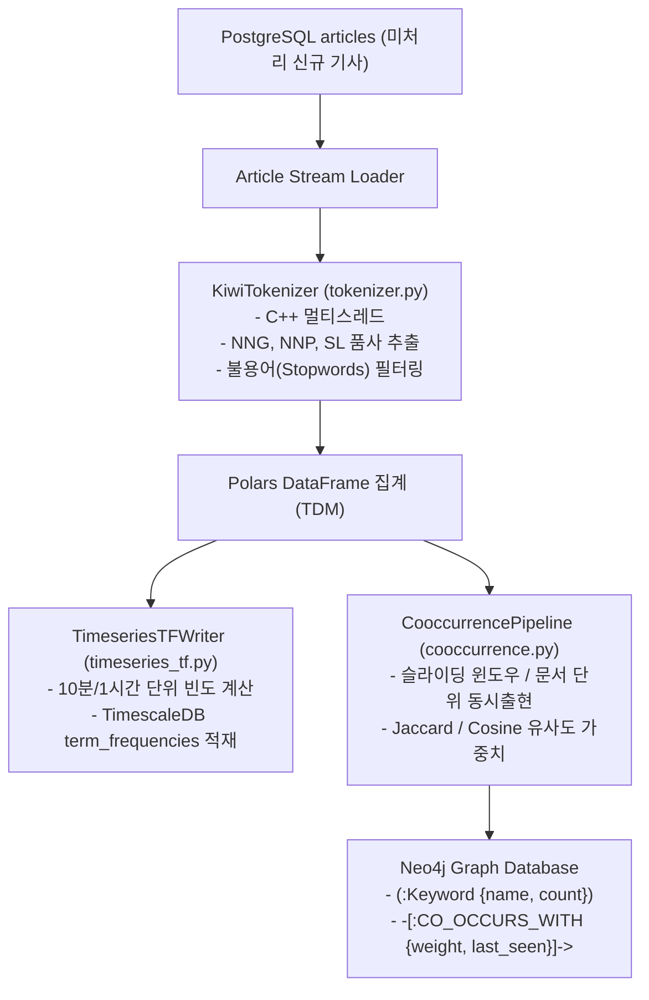

# SPEC-002: horus-nlp 자연어 처리 및 지식 그래프 파이프라인 명세서

## 1. 개요 및 목적

`horus-nlp`는 수집된 대규모 기사 텍스트를 고속으로 형태소 분석하여 시계열 단어 빈도(Term Frequency)를 집계하고, 단어 간 동시출현(Co-occurrence) 관계를 계산하여 Neo4j 지식 그래프를 구축/갱신하는 파이프라인 엔진입니다.
과거 분산 Spark Streaming/Batch를 대체하여 **Kiwi (C++ 바인딩 형태소 분석기)**와 **TimescaleDB Hypertable**, **Neo4j Cypher 일괄 최적화**를 통해 단일 노드에서 극도의 처리 효율을 달성합니다.

---

## 2. 파이프라인 구조 및 데이터 흐름



---

## 3. 세부 컴포넌트 명세

### 3.1. KiwiTokenizer ([`pipeline/tokenizer.py`](file:///Users/horus/dev/horus-dev/horus-nlp/pipeline/tokenizer.py))
* **엔진**: `kiwipiepy.Kiwi(num_workers=4)` (C++ 네이티브 멀티스레드)
* **추출 대상 품사(POS Tags)**:
  * `NNG` (일반 명사)
  * `NNP` (고유 명사 - 기업명, 인물명, 고유 브랜드)
  * `SL` (외국어 - 영어 약어, 티커 심볼 등)
* **전처리 및 필터 규칙**:
  * 단어 길이 $\ge 2$글자 (1글자 단어 제외, 단 주요 티커 예외 허용).
  * 한국어 조사, 어미, 특수문자, HTML 태그, URL 자동 제거.
  * 금융/시사 전용 사용자 불용어(Stopwords) 사전 적용 (`기자`, `뉴스`, `속보`, `무단전재` 등 배제).

### 3.2. TimeseriesTFWriter ([`pipeline/timeseries_tf.py`](file:///Users/horus/dev/horus-dev/horus-nlp/pipeline/timeseries_tf.py))
* **저장소**: PostgreSQL 16 + TimescaleDB Hypertable `term_frequencies`
* **스키마**:
  ```sql
  -- time, source_id, term, frequency, doc_count
  INSERT INTO term_frequencies (time, source_id, term, frequency, doc_count)
  VALUES ($1, $2, $3, $4, $5);
  ```
* **집계 롤업(Rollup)**:
  * 10분 단위 타임 버킷(`time_bucket('10 minutes', time)`)으로 실시간 급상승 키워드 추출 지원.

### 3.3. CooccurrencePipeline ([`pipeline/cooccurrence.py`](file:///Users/horus/dev/horus-dev/horus-nlp/pipeline/cooccurrence.py))
* **동시출현(Co-occurrence) 계산 알고리즘**:
  1. 동일 기사(Article) 내에서 동시 출현하는 단어 쌍 $(w_i, w_j)$ 추출 (단, $i < j$).
  2. 일괄 배치 윈도우 내에서 단어 쌍별 동시 출현 횟수($N_{ij}$) 및 각 단어의 개별 출현 횟수($N_i, N_j$) 집계.
  3. 관계 가중치(Weight) 계산:
     $$\text{Weight}(w_i, w_j) = \frac{N_{ij}}{\sqrt{N_i \times N_j}} \quad (\text{Normalized Pointwise Mutual Information})$$
* **Neo4j Cypher 일괄 적재 쿼리 (UNWIND Batch MERGE)**:
  ```cypher
  UNWIND $batch AS row
  MERGE (k1:Keyword {name: row.word1})
    ON CREATE SET k1.count = row.count1, k1.created_at = timestamp()
    ON MATCH SET k1.count = k1.count + row.count1
  MERGE (k2:Keyword {name: row.word2})
    ON CREATE SET k2.count = row.count2, k2.created_at = timestamp()
    ON MATCH SET k2.count = k2.count + row.count2
  MERGE (k1)-[r:CO_OCCURS_WITH]-(k2)
    ON CREATE SET r.weight = row.weight, r.co_count = row.co_count, r.updated_at = timestamp()
    ON MATCH SET r.weight = (r.weight * 0.8) + (row.weight * 0.2), r.co_count = r.co_count + row.co_count, r.updated_at = timestamp();
  ```

---

## 4. 실행 인터페이스 (CLI Commands)

```bash
# 1. 미처리 기사 전체 배치 형태소 분석 및 그래프 적재
python3 main.py --batch-size 1000

# 2. 최근 24시간 실시간 스트리밍 모드 실행
python3 main.py --stream --interval 60
```

---

## 5. 인수 및 검증 기준 (Acceptance Criteria)

* [ ] 1,000건의 기사 본문 텍스트 토큰화가 Kiwi 멀티스레드를 통해 5초 이내 완료되는가?
* [ ] 형태소 분석 결과가 TimescaleDB `term_frequencies` 테이블에 시계열 타임스탬프와 함께 저장되는가?
* [ ] Neo4j에 쿼리(`MATCH (k:Keyword)-[r:CO_OCCURS_WITH]-(t:Keyword) RETURN count(r)`) 실행 시 관계 엣지가 생성/갱신되는가?
* [ ] 3D 그래프 프론트엔드 API(`GET /api/v1/graph/cooccurrence`)에서 상위 가중치 엣지 및 노드 리스트가 올바른 JSON 규격으로 반환되는가?
