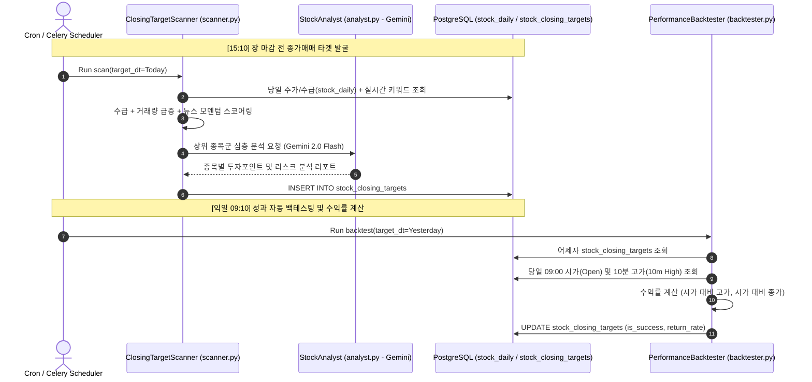

# SPEC-003: horus-quant 종가매매 퀀트 전략 및 백테스트 명세서

## 1. 개요 및 목적

`horus-quant`는 레거시 `BrainStocking`(Scala ZIO)을 Python 3.11+ 및 LLM 기반으로 현대화한 퀀트 트레이딩 분석 엔진입니다.
매 영업일 **15:10 (장 마감 20분 전)** 당일 KOSPI/KOSDAQ 수급(외국인/기관 동시 순매수) 및 실시간 뉴스 감성 키워드를 결합하여 **종가매매 추천 종목(`stock_closing_targets`)**을 추출하고, **익일 09:10 (장 시작 10분 후)** 시가 및 고가 데이터를 수집하여 수익률과 전략 성공 여부를 자동으로 역검증(Backtesting)합니다.

---

## 2. 퀀트 파이프라인 및 타임라인



---

## 3. 세부 컴포넌트 명세

### 3.1. ClosingTargetScanner ([`quant/scanner.py`](file:///Users/horus/dev/horus-dev/horus-quant/quant/scanner.py))
* **실행 시점**: 매 거래일 15:10 KST
* **후보 종목 필터 조건 (Screening Rules)**:
  1. **거래대금/거래량**: 당일 거래량이 20일 평균 거래량 대비 $200\%$ 이상 급증.
  2. **수급 주체**: 외국인(`foreigner > 0`)과 기관(`institution > 0`) 동시 순매수(쌍끌이 매수).
  3. **주가 위치**: 당일 등락률 $+3\% \sim +18\%$ (상한가 진입 전의 강한 추세주).
  4. **텍스트 모멘텀**: 당일 수집된 기사 중 해당 종목 키워드 출현 빈도 급증 및 긍정 감성.
* **스코어링 공식**:
  $$\text{Score} = w_1 \cdot \text{VolSurge} + w_2 \cdot (\text{Foreigner} + \text{Inst}) + w_3 \cdot \text{NewsMomentum}$$

### 3.2. StockAnalyst ([`quant/analyst.py`](file:///Users/horus/dev/horus-dev/horus-quant/quant/analyst.py))
* **엔진**: Hybrid LLM Gateway (Gemini 2.0 Flash 우선)
* **입력 프롬프트**: 종목 기본 정보, 당일 수급 수치, 관련 최신 뉴스 헤드라인 5개.
* **출력 구조**:
  - `핵심 매수 근거`: 수급 및 테마 모멘텀 요약.
  - `목표 매도가 / 손절가`: 1차 익절 라인 (+2.5%), 손절 라인 (-1.5%).
  - `주요 리스크`: 익일 갭하락 위험 및 주의 테마 이슈.

### 3.3. PerformanceBacktester ([`quant/backtester.py`](file:///Users/horus/dev/horus-dev/horus-quant/quant/backtester.py))
* **실행 시점**: 매 거래일 09:10 KST
* **수익률 산출 공식**:
  * **시가 진입 기준 고가 수익률**:
    $$\text{Return}_{\text{high}} = \frac{\text{NextDay 10m High} - \text{NextDay Open}}{\text{NextDay Open}} \times 100 (\%)$$
  * **성공 판정 기준 (`is_success`)**:
    * $\text{Return}_{\text{high}} \ge +2.0\%$ 이면 `is_success = TRUE`.

---

## 4. 데이터베이스 인터페이스 (I/O Specification)

### 4.1. 종목 원천 시세 테이블 (`stock_daily`)
```sql
CREATE TABLE IF NOT EXISTS stock_daily (
    target_dt DATE NOT NULL,
    code VARCHAR(20) NOT NULL,
    name VARCHAR(100),
    open_price INT, 
    high_price INT, 
    low_price INT, 
    close_price INT,
    volume BIGINT,
    individual BIGINT, 
    foreigner BIGINT, 
    institution BIGINT, 
    pension BIGINT,
    PRIMARY KEY (target_dt, code)
);
```

### 4.2. 종가매매 추천 및 백테스트 결과 테이블 (`stock_closing_targets`)
```sql
CREATE TABLE IF NOT EXISTS stock_closing_targets (
    id SERIAL PRIMARY KEY,
    target_dt DATE NOT NULL,
    code VARCHAR(20) NOT NULL,
    name VARCHAR(100) NOT NULL,
    strategy_name VARCHAR(50) NOT NULL,
    target_score FLOAT,
    closing_price INT NOT NULL,
    next_day_open INT, 
    next_day_10m_high INT, 
    next_day_close INT,
    return_rate_open FLOAT, 
    return_rate_high FLOAT,
    is_success BOOLEAN,
    analysis_report TEXT,
    created_at TIMESTAMPTZ DEFAULT NOW()
);
```

---

## 5. 실행 인터페이스 (CLI Commands)

```bash
# 1. 15:10 종가매매 타겟 스캔 실행 (당일 기준)
python3 main.py --mode scan --date 2026-08-22

# 2. 09:10 익일 성과 백테스트 검증 실행 (대상 추천일 지정)
python3 main.py --mode backtest --date 2026-08-21
```

---

## 6. 인수 및 검증 기준 (Acceptance Criteria)

* [ ] `scan` 모드 실행 시 조건에 부합하는 상위 3~5개 종목이 `stock_closing_targets` 테이블에 인서트되는가?
* [ ] 인서트된 각 종목에 Gemini 2.0 Flash로 생성된 `analysis_report` 텍스트가 정상 기록되는가?
* [ ] `backtest` 모드 실행 시 익일 시가 및 10분 고가 데이터를 조회하여 `return_rate_high` 및 `is_success`가 정확히 업데이트되는가?
* [ ] 프론트엔드 대시보드(`/quant`)에서 해당 내역이 카드/테이블 형태로 올바르게 시각화되는가?
